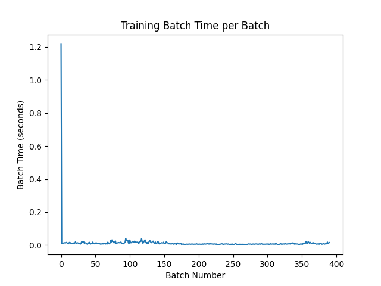
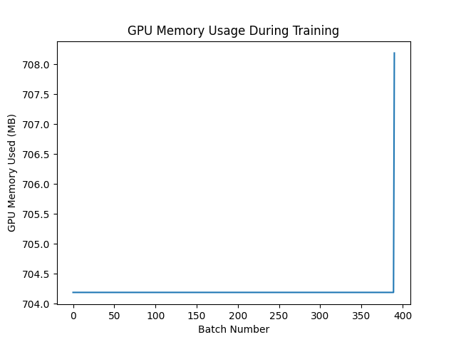
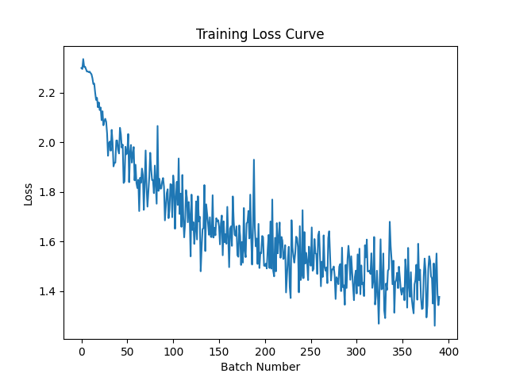

# Simulated Multi-GPU CNN Training using PyTorch DataParallel

## Run Notebook

[](https://colab.research.google.com/github/Krishnasai8500/Simulated-Multi-GPU-CNN-Training-using-PyTorch-DataParallel/blob/main/MultiGpu.ipynb)


## Project Overview

This project demonstrates a scalable deep learning training pipeline using **PyTorch DataParallel** to simulate multi-GPU training. The model is trained on the **CIFAR-10 dataset**, and GPU performance metrics such as **memory usage and batch training time** are monitored during training.

The project helps analyze **hardware utilization and training efficiency for AI workloads**.

---

## Technologies Used

- Python
- PyTorch
- CUDA
- DataParallel
- CIFAR-10 Dataset
- NVIDIA GPU
- Pandas
- Matplotlib

---

## Model Architecture

Simple CNN consisting of:

- 2 Convolution layers
- ReLU activation
- MaxPooling
- 2 Fully connected layers

---

## Training Setup

| Parameter | Value |
|-----------|-------|
| Dataset | CIFAR-10 |
| Batch Size | 128 |
| Optimizer | Adam |
| Loss Function | CrossEntropyLoss |
| Hardware | NVIDIA GPU (Google Colab) |

---

## Performance Metrics Collected

- Batch-wise training time
- GPU memory utilization
- Training loss

All metrics are stored in:

```
gpu_training_metrics.csv
```

---

## Results

### Batch Training Time



---

### GPU Memory Usage



---

### Training Loss



---

## Key Learnings

- Understanding how **PyTorch DataParallel distributes mini-batches across GPUs**
- Monitoring **GPU memory usage during training**
- Analyzing **training performance bottlenecks**
- Building **multi-GPU scalable training pipelines**

---

## Future Improvements

- Implement `DistributedDataParallel` (DDP)
- Train larger models (ResNet, VGG)
- Perform real multi-GPU training on cloud servers
- Add automatic alerts for GPU over-utilization or overheating

---

## Repository Structure

```
Simulated-Multi-GPU-CNN-Training
│
├── training_notebook.ipynb
├── batch_time_graph.png
├── gpu_memory_graph.png
├── loss_curve.png
├── gpu_training_metrics.csv
├── requirements.txt
└── README.md
```

---

## Installation

```bash
git clone https://github.com/Krishnasai8500/gpu-acceleration-analysis.git
cd gpu-acceleration-analysis
pip install -r requirements.txt
```

---

## Requirements

```
torch
torchvision
pandas
matplotlib
pynvml
```

---

## Author

**Krishna Sai** — [GitHub](https://github.com/Krishnasai8500) | [LinkedIn](#)
